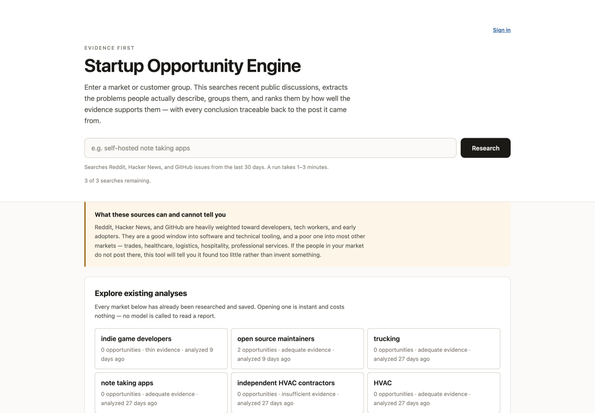
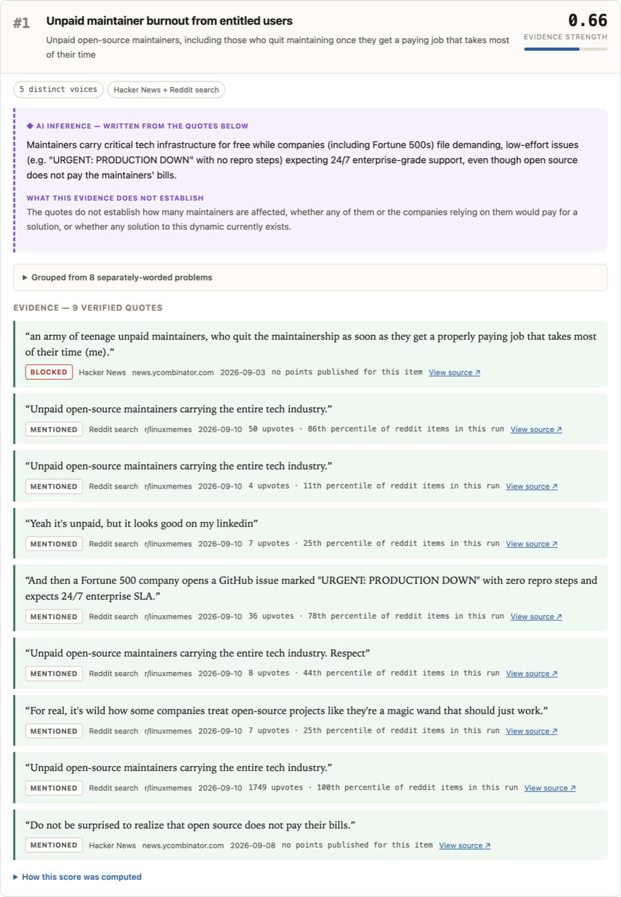

# Startup Opportunity Engine

You type in a market or a customer group, like `open source maintainers` or
`independent HVAC contractors`. The app searches recent public discussions on
Reddit, Hacker News, and GitHub, pulls out the problems people actually
describe, groups the similar ones, and ranks them by how well the evidence
supports them. Every conclusion links back to the posts it came from.

I built this because most AI idea generators work backwards. They invent a
plausible startup idea first, then go find citations that roughly fit. Here the
model is never allowed to name an opportunity. An opportunity only exists if a
cluster of verified quotes clears a floor, and the ranking is computed by plain
code before any prose gets written.

**Live: https://startup-opportunity-engine.vercel.app**

Browsing saved analyses is free and needs no account.



## What a result looks like

Each opportunity shows its Evidence Strength score, how many distinct people it
came from, which platforms, the AI-written summary clearly labeled as AI, and
every verified quote underneath with a link to the original.



Three kinds of content are styled differently so you can always tell them apart:
verbatim quotes are in serif with a green rule, computed numbers are in
monospace and can be expanded to show the arithmetic, and model prose sits on a
tinted panel with a dashed border. A "Hide AI inference" toggle collapses all of
the model prose at once and leaves a pure evidence view.

## Main features

- **Four dedup passes** so the same complaint reposted five times does not look
  like five people. Duplicates are kept in the record with a reason instead of
  being silently dropped.
- **Distinct-voice counting.** One person complaining repeatedly is one voice.
  There is a cap of three per thread and four per repo or subreddit, so a single
  viral thread cannot manufacture an opportunity.
- **A verbatim gate on extraction.** The model has to return a quote that
  appears word for word in that specific document. If it does not, the
  extraction is thrown away and counted as a failure.
- **Statement classification.** A feature request, a launch announcement, and a
  real complaint are not the same thing. Only first-hand and reported problems
  count toward a score. Everything set aside is shown with its reason.
- **Engagement is never summed across platforms.** A Reddit upvote and an HN
  point are different units, so each item is ranked inside its own source's
  distribution and the native count is always displayed next to it.
- **Rank sensitivity.** The weights behind the score are my own judgment and I
  have not validated them against anything, so the app sweeps a range of
  reasonable weightings and shows results like "placed 1 to 2 depending on
  weighting" instead of pretending one ordering is the truth.
- **Weight sliders** that re-rank in the browser against the saved report, with
  no server round trip and no model call.
- **Honest failure states.** Collecting 115 posts and failing to read all of
  them is different from reading them and finding nothing. The app keeps
  `unknown` and `insufficient` as separate verdicts.
- **Three free analyses per visitor**, counted in Postgres against an HttpOnly
  cookie, with a per-network daily backstop. Reading is unmetered.

## How it works

```
your query
  -> a model proposes subreddits, each one probed against the live archive
     and dropped if it does not exist or has posted nothing in the window
  -> collect from Hacker News, GitHub issues, Reddit search, Reddit archive
  -> four dedup passes
  -> extract problems, each backed by a quote verified verbatim
  -> classify every statement, discard the ones that are not customer problems
  -> group the phrases into themes
  -> score and rank with deterministic code
  -> write prose for each surviving cluster
  -> save the whole report to Postgres as jsonb
```

The model is used at exactly four of those steps and boxed in at each one. It
picks where to look but never sees evidence. It extracts but must quote
verbatim. It regroups phrases that extraction already produced and cannot invent
new ones. It writes prose for one cluster while seeing only that cluster's
quotes. Deduplication, clustering, engagement normalization, scoring, ranking,
and the evidence floor are all ordinary code. There is no cross-cluster
synthesis step anywhere, because that is where invention would creep in.

Reading and generating are treated very differently on purpose. Generating a
report is slow and costs money. Reading one is a single database query with no
model in the path, which is why the whole site is open with no account.

## Tech stack

| Layer | What I used |
| --- | --- |
| Server | Node.js with the built-in `node:http`, no web framework |
| Frontend | Vanilla HTML, CSS, and JS. No framework, no build step |
| Database | [Neon](https://neon.tech) serverless Postgres, reports stored as `jsonb` |
| Auth | [Better Auth](https://better-auth.com), optional |
| AI stages | The local `claude` CLI as a subprocess, no API key |
| Tests | `node:test` (144 tests) plus Playwright for browser checks |
| Hosting | Vercel |

Runtime dependencies are `@neondatabase/serverless`, `better-auth`, and `pg`.
Playwright is the only dev dependency.

## Running it locally

You need Node 20 or newer and a Neon database.

```bash
npm install
cp .env.example .env     # fill in DATABASE_URL and BETTER_AUTH_SECRET

npx @better-auth/cli migrate --config lib/auth.js   # accounts, sessions
npm run migrate                                     # markets, runs, counters

npm start                # http://localhost:3000
```

`npm run migrate` applies the files in [lib/migrations/](lib/migrations/) in
filename order, once each.

To actually generate a new analysis you also need the `claude` CLI on your
`PATH` and `python3` for the Reddit collector, then:

```bash
GENERATION_ENABLED=true npm start
```

`GENERATION_ENABLED` is a global kill switch that fails closed. Only the literal
string `true` turns generation on, in any environment, for anyone. It is off by
default because a run spends real money.

Tests:

```bash
npm test                 # 144 tests, needs DATABASE_URL
npm run test:browser     # browser checks against a running server
```

All the environment variables are documented in [.env.example](.env.example).

## Limitations

These are real and I would rather say them than have you find them.

- **The live site cannot generate new analyses.** Generation shells out to the
  local `claude` CLI, and a Vercel serverless function has no CLI to run and
  would time out on a multi-minute pipeline anyway, so it answers `503`. New
  markets appear when I run the pipeline on my laptop against the same Neon
  database. Browsing and reading work fine for everyone. Making generation work
  in production is the main thing left to build, and
  [lib/claude.js](lib/claude.js) is the one file that would have to change.
- **The sources are biased.** Reddit, Hacker News, and GitHub skew hard toward
  developers and early adopters. For HVAC contractors, dental practices, or
  commercial bakeries they return almost nothing useful. The app measures that
  and refuses to continue below the floor rather than squeezing an opportunity
  out of four tangential posts. That warning is shown on every run.
- **Evidence Strength is not a prediction of startup success.** It measures one
  thing, which is how well supported a problem is by the sources I searched. It
  knows nothing about market size, willingness to pay, competition, feasibility,
  regulation, or timing.
- **Empty results are common and often correct.** The floor is three distinct
  voices across two independent platforms. A trucking run found 54 genuine
  customer statements from 45 people and still produced zero opportunities,
  because each platform was talking about something different.
- **Theme grouping is AI-assisted rather than deterministic.** I tested purely
  lexical clustering against a real 65-phrase run and it could not work. Any
  threshold loose enough to merge "Cannot access notes across devices" with "Org
  mode lacks device syncing" also merged genuinely different problems. The model
  only regroups phrases that already exist and its output is validated, but this
  is a real deviation from a fully deterministic pipeline.
- **Runs are slow and cost real money.** Across the ten runs I have saved, the
  ones that completed took between 3 and 12 minutes, and one degraded run took
  42. Almost all of the LLM spend is in extraction. Runs that halt early on the
  coverage gate finish in seconds.
- **Relevance filtering is blunt.** It requires two of the query's meaningful
  words within about 200 characters of each other, which removes a lot of noise
  but also drops posts that discuss a market without using its words.
- **Reddit post authors are often missing** from the keyless lanes, so those
  posts fall back to per-item voice identity. Comment bodies are also excerpts,
  so a problem stated only in the truncated remainder of a long comment is
  missed.

## Repo layout

```
server.js              routing, SSE progress stream, static files
lib/
  pipeline.js          the stages, in order
  claude.js            the only module that calls a model
  collectors/          hackernews.js, github.js, reddit.js, reddit-archive.js
  dedupe.js            the four dedup passes
  extract.js           problem extraction and the verbatim quote gate
  theme.js             AI theme grouping, validated
  cluster.js           deterministic lexical grouping
  score.js             Evidence Strength and rank sensitivity
  coverage.js          the honest stop
  analysis.js          run state and failure classification
  usage.js             the visitor cookie and the free-search meter
  access.js            admin allowlist, kill switch, rate limit
  store.js             markets and append-only analysis_runs
  db.js                Neon client
public/                the whole frontend
tests/                 144 unit tests plus browser checks
runs/                  frozen pre-database runs, kept as test fixtures
```

I also ran a security and cost-abuse audit against the live deployment partway
through and wrote up what I found and how I fixed it in
[SECURITY_AUDIT.md](SECURITY_AUDIT.md).

## License

MIT
